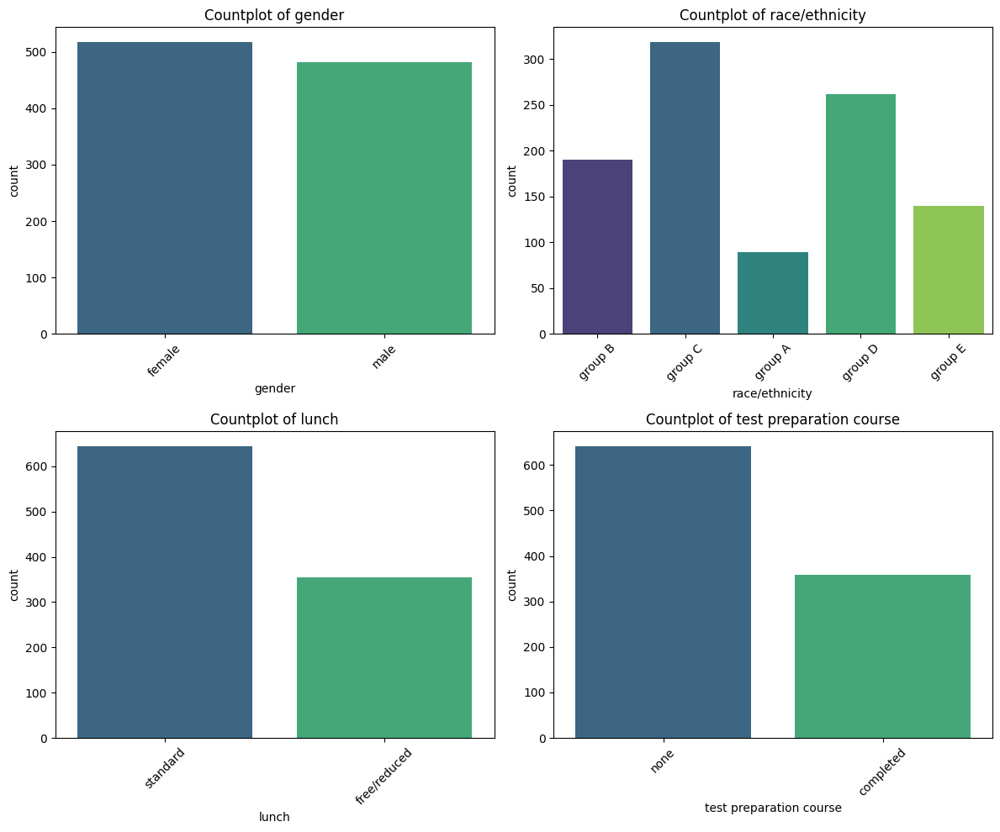
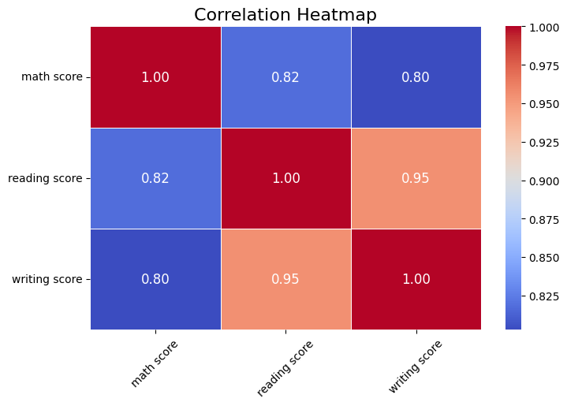
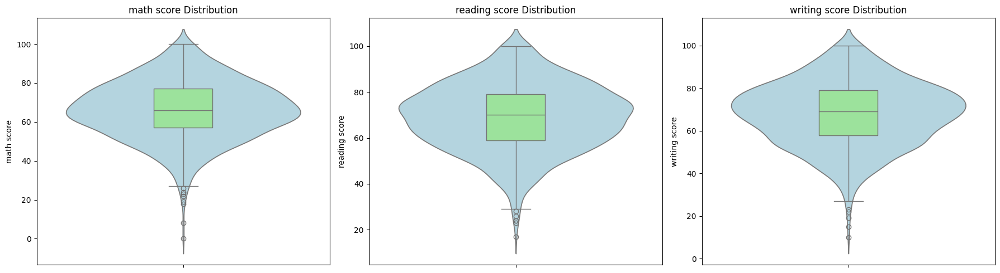
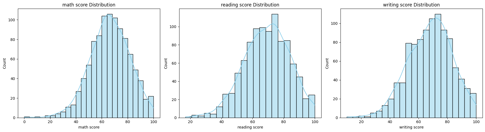

# 📊 Basic Analysis and Statistics

---

## 🎯 Module Overview

This module focuses on performing **foundational statistical analysis** on a selected dataset using both **Python and R**. It covers essential exploratory and descriptive operations, data visualization, distribution analysis, and outlier detection, providing a practical framework for understanding and analyzing data.

---

## 📊 Dataset Information

### [🎓 Students Performance in Exams Dataset](https://www.kaggle.com/datasets/spscientist/students-performance-in-exams)

This dataset contains information on **student demographics and academic performance** in three subjects: Mathematics, Reading, and Writing. It includes **1,000 observations** and **8 variables**, providing a mix of categorical and numerical data for statistical analysis.

### 📋 Dataset Structure
 

|  Variable |  Type |  Description |  Examples |
|-------------|---------|----------------|-------------|
| `gender` |  Categorical | Student gender | male, female |
| `race/ethnicity` |  Categorical | Ethnic group | Group A, B, C, D, E |
| `parental.level.of.education` |  Categorical | Highest parental   education | Bachelor's, High School, Some College |
| `lunch` |  Categorical | Lunch program | Standard, Free/Reduced |
| `test.preparation.course` |  Categorical | Test prep status | Completed, None |
| `math.score` |  Numerical | Math exam score | 0-100 |
| `reading.score` |  Numerical | Reading score | 0-100 |
| `writing.score` |  Numerical | Writing score | 0-100 |

---

##  📓 Code Notebooks

### 📚 Interactive Notebooks

| 🐍 Python | 📊 R |
|-----------|------|
|  |  |
| **[01_basic_statistics.ipynb](notebooks/python/01_basic_statistics.ipynb)** | **[01-basic-statistics.ipynb](notebooks/R/01-basic-statistics.ipynb)** |

---

## 📖 Table of Contents

### 📈 Descriptive Statistics
- [Mean (Arithmetic Average)](#mean-arithmetic-average)
- [Median](#median)
- [Mode](#mode)
- [Variance](#variance)
- [Standard Deviation](#standard-deviation)
- [Range](#range)
- [Quantiles](#quantiles)
- [Skewness & Kurtosis](#skewness--kurtosis)

### 🔤 Categorical Data Analysis
- [Frequency Tables](#frequency-tables)
- [Bar Charts](#bar-charts)

### 🔗 Relationships & Dependencies
- [Covariance](#covariance)
- [Correlation Analysis](#correlation-analysis)
- [Correlation Heatmaps](#correlation-heatmaps)

### 🎯 Outlier Detection
- [IQR Method](#iqr-method)
- [Boxplots & Violin Plots](#boxplots--violin-plots)

### 📊 Continuous Variable Distributions
- [Histograms & Kernel Density Estimation](#histograms--kernel-density-estimation)

 

---

## Mean (Arithmetic Average)

> **Definition**: The mean represents the **central tendency** of a dataset and provides the average value of all observations.

### Mathematical Formula 

$$
\bar{X} = \frac{1}{n} \sum_{i=1}^{n} X_i
$$

Where:
- $\bar{X}$ = Sample mean
- $n$ = Number of observations
- $X_i$ = Individual observation

###  Key Properties
- **Sensitive to outliers**: Extreme values significantly impact the mean
- **Best for**: Symmetric distributions without outliers
- **Interpretation**: Represents the "balance point" of the data

---

## Median

> **Definition**: The median is the **middle value** that divides a dataset into two equal halves when arranged in ascending order.

### Mathematical Formula

**For odd number of observations (n is odd):**
$$
\text{Median} = X_{\left(\frac{n+1}{2}\right)}
$$

**For even number of observations (n is even):**
$$
\text{Median} = \frac{X_{\left(\frac{n}{2}\right)} + X_{\left(\frac{n}{2}+1\right)}}{2}
$$

### Key Properties
- **Robust to outliers**: Not affected by extreme values
- **Best for**: Skewed distributions or data with outliers
- **Interpretation**: 50% of data falls below this value

---

## Mode

> **Definition**: The mode is the **most frequently occurring value** in a dataset.

### Mathematical Formula

$$
\text{Mode} = \arg\max_x f(x)
$$

Where $f(x)$ represents the frequency of value $x$.

### Key Properties
- **Types**: Unimodal (one mode), Bimodal (two modes), Multimodal (multiple modes)
- **Best for**: Categorical data and understanding most common occurrences
- **Note**: A dataset may have no mode, one mode, or multiple modes

---

## Variance

> **Definition**: Variance measures how **spread out** the data points are around the mean, indicating data variability.

### Mathematical Formula

**Sample Variance:**
$$
s^2 = \frac{1}{n-1} \sum_{i=1}^{n} \left(X_i - \bar{X}\right)^2
$$

**Population Variance:**
$$
\sigma^2 = \frac{1}{n} \sum_{i=1}^{n} \left(X_i - \mu\right)^2
$$

### Key Properties
- **Units**: Squared units of the original data
- **Range**: Always non-negative (≥ 0)
- **Interpretation**: Higher variance indicates more scattered data

---

## Standard Deviation

> **Definition**: Standard deviation represents the **average distance** of data points from the mean, expressed in original units.

### Mathematical Formula

**Sample Standard Deviation:**
$$
s = \sqrt{\frac{1}{n-1} \sum_{i=1}^{n} \left(X_i - \bar{X}\right)^2}
$$

### Key Properties
- **Units**: Same as original data
- **68-95-99.7 Rule**: In normal distributions, ~68% of data falls within 1σ, ~95% within 2σ, ~99.7% within 3σ
- **Interpretation**: More intuitive than variance for understanding spread

---

## Range

> **Definition**: Range represents the **total spread** of the dataset from minimum to maximum value.

### Mathematical Formula

$$
\text{Range} = \max(X) - \min(X)
$$

### Key Properties
- **Simplicity**: Easy to calculate and understand
- **Limitation**: Sensitive to outliers
- **Use Case**: Quick assessment of data spread

---

## Quantiles

> **Definition**: Quantiles divide the dataset into **equal parts**, helping understand the distribution of values across different percentiles.

### Mathematical Formula

$$
Q_p = X_{(\lceil np \rceil)}
$$

Where:
- $Q_p$ = p-th quantile
- $n$ = number of observations
- $p$ = proportion (0 ≤ p ≤ 1)

### Common Quantiles
- **Q1 (25th percentile)**: First quartile
- **Q2 (50th percentile)**: Median
- **Q3 (75th percentile)**: Third quartile
- **IQR**: Q3 - Q1 (Interquartile Range)

---

## Skewness & Kurtosis

> **Definition**: These measures describe the **shape characteristics** of a distribution beyond central tendency and dispersion.

### Skewness

**Measures distribution asymmetry:**

$$
\text{Skewness} = \frac{1}{n} \sum_{i=1}^{n} \left(\frac{X_i - \bar{X}}{s}\right)^3
$$

**Interpretation:**
- **Skewness = 0**: Perfectly symmetric
- **Skewness > 0**: Right-skewed (positive skew)
- **Skewness < 0**: Left-skewed (negative skew)

### Kurtosis

**Measures distribution "tailedness":**

$$
\text{Kurtosis} = \frac{1}{n} \sum_{i=1}^{n} \left(\frac{X_i - \bar{X}}{s}\right)^4 - 3
$$

**Interpretation:**
- **Kurtosis = 0**: Normal distribution (mesokurtic)
- **Kurtosis > 0**: Heavy tails (leptokurtic)
- **Kurtosis < 0**: Light tails (platykurtic)

---

## Frequency Tables

> **Purpose**: Summarize categorical data by showing the count and proportion of each category.

### Key Components
- **Absolute Frequency**: Raw count of occurrences
- **Relative Frequency**: Proportion of total
- **Cumulative Frequency**: Running total

### Example from Dataset

<b>Gender:</b>
<table>
  <tr><th>Category</th><th>Count</th></tr>
  <tr><td>Female</td><td>518</td></tr>
  <tr><td>Male</td><td>482</td></tr>
</table>

<b>Race/Ethnicity:</b>
<table>
  <tr><th>Category</th><th>Count</th></tr>
  <tr><td>Group C</td><td>319</td></tr>
  <tr><td>Group D</td><td>262</td></tr>
  <tr><td>Group B</td><td>190</td></tr>
  <tr><td>Group E</td><td>140</td></tr>
  <tr><td>Group A</td><td>89</td></tr>
</table>

---

## Bar Charts

> **Purpose**: Visualize categorical data distributions through vertical or horizontal bars.

### Best Practices
- Use consistent bar width
- Order categories logically
- Include clear labels and titles
- Consider color coding for groupings

### Visualization

---

## Covariance

> **Definition**: Covariance measures the **joint variability** between two variables.

### Mathematical Formula

$$
\text{Cov}(X,Y) = \frac{1}{n-1} \sum_{i=1}^{n} (X_i - \bar{X})(Y_i - \bar{Y})
$$

### Interpretation
- **Positive**: Variables increase together
- **Negative**: One increases while the other decreases
- **Zero**: No linear relationship

### Example from Dataset

|                   | Math Score | Reading Score | Writing Score |
| ----------------- | ---------- | ------------- | ------------- |
| **Math Score**    | 229.92     | 181.00        | 184.94        |
| **Reading Score** | 181.00     | 213.17        | 211.79        |
| **Writing Score** | 184.94     | 211.79        | 230.91        |

---

## Correlation Analysis

> **Definition**: Correlation measures the **strength and direction** of linear relationships between variables.

### Pearson Correlation Coefficient

$$
r = \frac{\sum_{i=1}^{n} (X_i - \bar{X})(Y_i - \bar{Y})}{\sqrt{\sum_{i=1}^{n} (X_i - \bar{X})^2 \sum_{i=1}^{n} (Y_i - \bar{Y})^2}}
$$

### Interpretation 
- Values close to **1** indicate a strong **positive relationship**
- Values close to **-1** indicate a strong **negative relationship** 
- Values around **0** indicate little to no **linear relationship** 

### Example from Dataset

|                   | Math Score | Reading Score | Writing Score |
| ----------------- | ---------- | ------------- | ------------- |
| **Math Score**    | 1.000      | 0.818         | 0.803         |
| **Reading Score** | 0.818      | 1.000         | 0.955         |
| **Writing Score** | 0.803      | 0.955         | 1.000         |

---
## Correlation Heatmaps

> **Purpose**: Visualize **correlation matrices** with color-coded intensity.

### Best Practices
- Use diverging color schemes
- Include correlation values
- Order variables by clustering
- Highlight significant correlations

### Visualization

---

## IQR Method

> **Purpose**: Detect outliers using the **Interquartile Range** approach.

### Outlier Detection Formula

$$
\text{Lower Bound} = Q_1 - 1.5 \times IQR
$$

$$
\text{Upper Bound} = Q_3 + 1.5 \times IQR
$$

Where:

$$
IQR = Q_3 - Q_1
$$

### Classification
- **Mild Outliers**: Beyond 1.5×IQR
- **Extreme Outliers**: Beyond 3×IQR

### Example from Dataset
- **Math Score Outliers**: 8  
- **Reading Score Outliers**: 6  
- **Writing Score Outliers**: 5
---

## Boxplots & Violin Plots

> **Purpose**: Visualize data distribution, quartiles, and outliers simultaneously.

### Boxplot Components
- **Box**: Q1 to Q3 (IQR)
- **Median Line**: Q2 within the box
- **Whiskers**: Extend to non-outlier extremes
- **Points**: Individual outliers

### Violin Plot Advantages
- Shows full distribution shape
- Combines boxplot with kernel density
- Better for multimodal distributions

### Visualization

**Explanation:**

   The combined boxplots and violin plots display the distribution of the three numeric scores (Math, Reading, Writing). The violin plots show a wide spread of the data on both sides, reflecting asymmetry and variability. The boxplots clearly indicate the interquartile range and median, while the individual points highlight the outliers.
> 

---

## Histograms & Kernel Density Estimation

> **Purpose**: Visualize the **frequency distribution** and **probability density** of continuous variables simultaneously.

### Key Points
- Histogram shows the **count of observations** in each bin  
- KDE (Kernel Density Estimation) shows a **smoothed probability density curve**  
- Useful for spotting **skewness, modality, and distribution shape**  

### Visualization

**Explanation:**

  The histograms combined with KDE plots show that the numeric scores are generally concentrated between **60–80**. All three numeric variables (Math, Reading, Writing) display a similar pattern: higher frequencies occur in the **80–100 range**, while very low scores in the **0–40 range** are relatively rare. Overall, the distributions are approximately **normal**, with no extreme skewness.

---

 <h1 style="font-size: 48px; text-align:center;">🎉 Thank You!</h1>

  <em>Thank you for reading and your interest. Keep exploring! ✨</em>

  For more hands-on exercises and detailed analysis, refer to the Python and R notebooks linked above.

